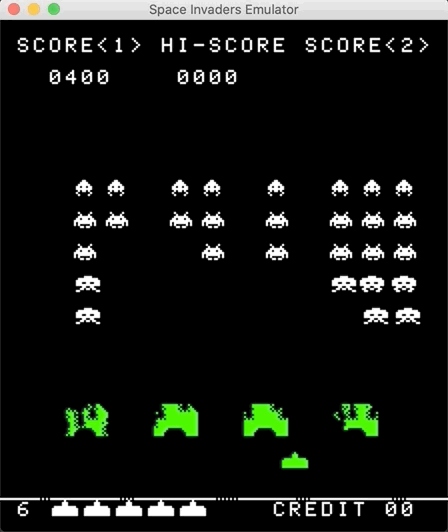
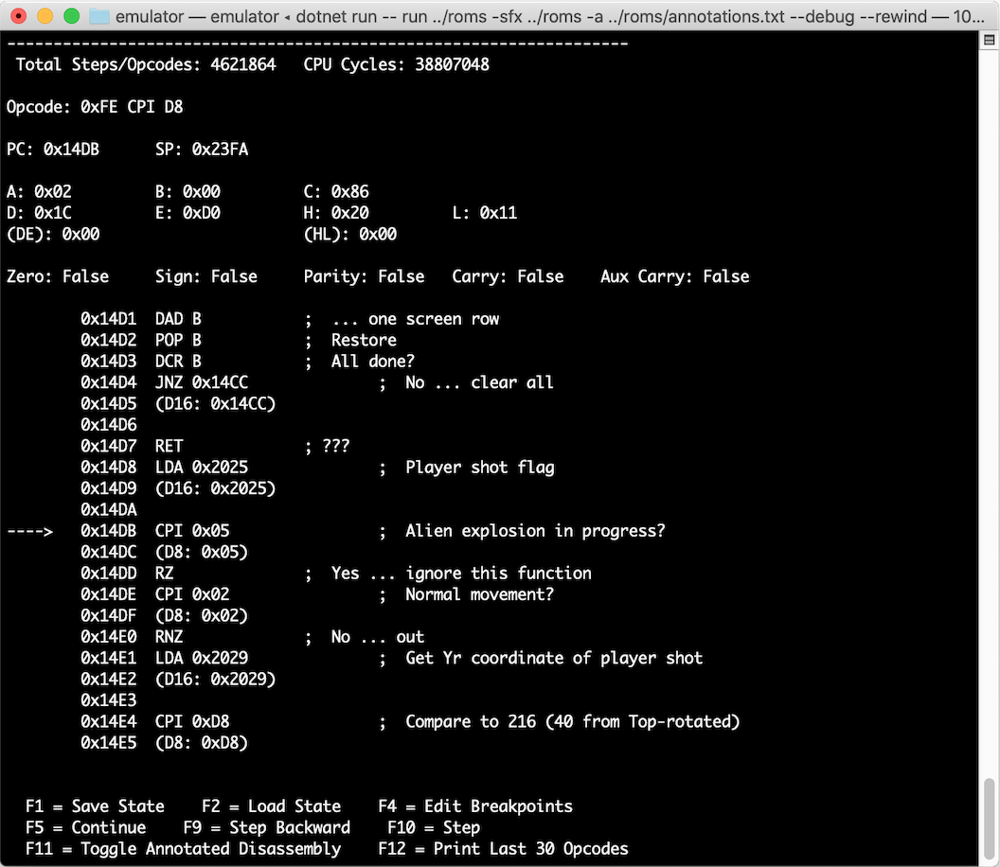

# Space Invaders Emulator

This repository contains my implementation of an emulator for the Intel 8080 CPU and the related hardware for the 1978 arcade game: Space Invaders!



## Implementation

I wrote the emulator and disassembler in C# targeting the cross-platform [.NET Core](https://dotnet.microsoft.com/) runtime.

I'm using [SDL2](https://www.libsdl.org/) and [SDL2_mixer](https://www.libsdl.org/projects/SDL_mixer/) for the GUI and audio via the [SDL2#](https://github.com/flibitijibibo/SDL2-CS) wrapper.

I use the [zasm](https://k1.spdns.de/Develop/Projects/zasm/Distributions/) to assemble my unit test cases, which are written in Intel 8080 assembly language.

The controls are hardcoded as:

* Insert Coin: `5`
* 1 Player Start: `1`
* 2 Player Start: `2`
* Player 1 - Left/Right: `left arrow` / `right arrow`
* Player 1 - Fire: `space`
* Player 2 - Left/Right: `a` / `d`
* Player 2 - Fire: `p`
* Tilt: `t`
* Break/Debug: `BREAK` / `PAUSE` / `9`

## Compiling / Running

1. Install [.NET Core](https://dotnet.microsoft.com/download) 3.2
2. Clone this repository
3. `cd emulator`
4. `dotnet restore`
5. `dotnet run --` followed by the commands to pass to the CLI program

Currently there is only one command, `run`:

```
$ dotnet run -- run --help

Usage: siemu run [arguments] [options]

Arguments:
  [ROM path]  The path to a directory containing the Space Invaders ROM set to load.

Options:
  -?|-h|--help          Show help information
  -sfx|--sound-effects  The path to a directory containing the WAV sound effects to be used.
  -ss|--starting-ships  Specify the number of ships the player starts with; 3 (default), 4, 5, or 6.
  -es|--extra-ship      Specify the number points needed to get an extra ship; 1000 (default) or 1500.
  -l|--load-state       Loads an emulator save state from the given path.
  -d|--debug            Run in debug mode; enables internal statistics and logs useful when debugging.
  -b|--break            Used with debug, will break at the given address and allow single stepping opcode execution (e.g. --break 0x0248)
  -r|--rewind           Used with debug, allows for single stepping in reverse to rewind opcode execution.
  -a|--annotations      Used with debug, a path to a text file containing memory address annotations for interactive debugging (line format: 0x1234 .... ; Annotation)
```

For example: `dotnet run -- run ../roms --sfx ../roms --starting-ships 6`

## Disassembler

While the disassembler is mainly used by the interactive debugger, it can be run from the command line as well:

1. `cd disassembler`
2. `dotnet restore`
3. `dotnet run --` followed by the commands to pass to the CLI program

Currently there is only one command, `disassemble`:

```
$ dotnet run -- disassemble --help

Usage: i8080disasm disassemble [arguments] [options]

Arguments:
  [ROM path]  The path to the ROM file to disassemble (or directory containing invaders.e through .h).

Options:
  -?|-h|--help     Show help information
  -o|--output      The path to the to output file.
  -a|--address     Include addresses in the disassembly.
  -p|--pseudocode  Include pseudocode in the disassembly (a comment on each line).
```

For exmaple: `dotnet run -- disassemble ../roms -a -p -o ../roms/output.asm`

## Interactive Debugger

If the emulator is launched with the `--debug` option, the debugger will be enabled. You can press the `pause`/`break` or `9` key which will stop execution and print the interactive debugger in the console.



From there you can use `F1` and `F2` to **save** and **load** the emulator **state**.

To **single step** over an opcode use `F10`, or `F5` to **continue** until the next breakpoint.

**Breakpoints** can be set via the `--break` option at startup, or in the debugger by pressing `F4`.

If the emulator was started with the `--annotations` option, `F11` can be used to toggle between the disassembler's generated psuedocode or the provided annotation file. This is used to **show comments for each disassembled opcode** inline in the debugger, which makes tracking down issues and/or understanding the game code easier. I collected annotations from the amazing [Computer Archeology](http://computerarcheology.com/) page on [Space Invaders Code](http://computerarcheology.com/Arcade/SpaceInvaders/Code.html), and placed them at [`roms/annotations.txt`](roms/annotations.txt).

`F12` is used to print the last 30 opcodes, so you can see **execution history**.

Finally, if `--rewind` was specified at startup, `F9` can be used to single step _backwards_ over opcodes, effectively allowing you to **rewind CPU state one instruction at a time**. I found this to be very helpful when tracking down bugs in the CPU core.

## Unit Tests

While building the emulator I found it essential to write unit tests for each opcode and along the way. This made it much easier to track down bugs late in development.

Additionally, there is an [integration test](intel8080.tests/Tests/CPUIntegrationTest.cs) which uses a CPU test program written for the Intel 8080 CPU _from 1980!_. The assembled program along with it's disassembly can can be found in the [`intel8080.tests/CPUDiag`](intel8080.tests/CPUDiag) directory.

Emulator tests (9):
1. `cd emulator.tests`
2. `dotnet restore`
3. `dotnet test`

Intel 8080 CPU tests (603):
1. `cd intel8080.tests`
2. `dotnet restore`
3. `dotnet test`

## Resources

I found the following resources useful in building this emulator:

* [Intel 8080 Assembly Programming Manual](https://www.google.com/search?q=intel+8080+assembly+language+programming+manual)
  * [Mirror](https://altairclone.com/downloads/manuals/8080%20Programmers%20Manual.pdf)
  * [Mirror](http://www.classiccmp.org/dunfield/r/8080asm.pdf)
  * [Mirror](http://www.nj7p.org/Manuals/PDFs/Intel/9800004C.pdf)
* [Emulator 101](http://www.emulator101.com/welcome.html)
  * [8080 Opcodes](http://www.emulator101.com/8080-by-opcode.html)
* [Intel 8080 Instruction Set](https://www.pastraiser.com/cpu/i8080/i8080_opcodes.html)
* [Computer Archeology - Space Invaders](http://computerarcheology.com/Arcade/SpaceInvaders/)
  * [Hardware](http://computerarcheology.com/Arcade/SpaceInvaders/Hardware.html)
  * [Code](http://computerarcheology.com/Arcade/SpaceInvaders/Code.html)
* 8080/8080 CPU Diagnostics Program
  * [Source](https://github.com/begoon/i8080-core/blob/master/TEST.ASM)
  * [Assembled Version](http://www.emulator101.com/files/cpudiag.bin)
* [Intel 8080 CPU Emulator](https://www.tramm.li/i8080/index.html)
* [zasm Disassembler](https://k1.spdns.de/Develop/Projects/zasm/Distributions/)
